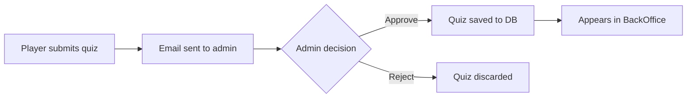

# Quick Start Guide - Email-Based Quiz Approval

## 🚀 Quick Setup (3 Steps)

### 1. Get Gmail App Password
1. Visit: https://myaccount.google.com/apppasswords
2. Create: **Mail** → **Other (PerFran)** → **Generate**
3. Copy: 16-character password (e.g., `abcd efgh ijkl mnop`)

### 2. Update Config
Open: `c:\xampp\htdocs\perfran\PerFran-master\PerFranMVC\config\email_config.php`

Replace this line:
```php
'smtp_password' => 'your-app-password-here',
```

With your password (no spaces):
```php
'smtp_password' => 'abcdefghijklmnop',
```

Save the file.

### 3. Test It!
1. Go to: http://localhost/perfran/PerFran-master/PerFranMVC/View/FrontOffice/suggest.php
2. Submit a quiz (at least 3 blanks in [brackets])
3. Check email: mahdimk.kar2005@gmail.com
4. Click **Approve** or **Reject** button

---

## 📧 How It Works



**Old way:** Quiz saved to database → admin approves in BackOffice  
**New way:** Email sent → admin approves via email → quiz saved to database

---

## 🎨 What the Email Looks Like

- **Header:** Purple gradient "🎯 Nouvelle Suggestion de Quiz"
- **Badge:** Color-coded difficulty (easy/medium/hard)
- **Preview:** Quiz text with blanks shown as `______`
- **Answers:** Green box listing all correct answers
- **Intruders:** Yellow box (if present)
- **Buttons:** Big green "✅ Approuver" and red "❌ Rejeter"

---

## 🔍 Testing Checklist

- [ ] Gmail App Password configured in `email_config.php`
- [ ] Submit quiz through suggest.php
- [ ] Email received in inbox
- [ ] Click "Approve" button
- [ ] Quiz appears in database with `approved = 1`
- [ ] Submit another quiz
- [ ] Click "Reject" button
- [ ] Quiz NOT in database

---

## 📁 Key Files

| File | Purpose |
|------|---------|
| `config/email_config.php` | Email settings (⚠️ needs app password) |
| `Controller/QuizSuggestionEmailer.php` | Email sending logic |
| `Controller/handle_approval.php` | Approval/rejection handler |
| `View/FrontOffice/suggest.php` | Form (modified to send email) |
| `data/pending_suggestions/` | Temporary storage |

---

## ❓ Troubleshooting

**Email not sending?**
- Check `smtp_password` in `config/email_config.php`
- Make sure it's an App Password (not regular password)
- Check XAMPP error log: `c:\xampp\apache\logs\error.log`

**Links not working?**
- Check `base_url` in `config/email_config.php`
- Should be: `http://localhost/perfran/PerFran-master/PerFranMVC`

**Invalid credentials?**
- Generate a new App Password
- Make sure 2-Step Verification is enabled

---

## 🎯 Ready to Use!

1. Configure Gmail App Password
2. Test submit → email → approve
3. Done! ✅

---

**For detailed documentation, see:**
- [SETUP_EMAIL.md](file:///c:/xampp/htdocs/perfran/PerFran-master/PerFranMVC/SETUP_EMAIL.md) - Full setup guide
- [walkthrough.md](file:///C:/Users/User/.gemini/antigravity/brain/d691c13d-262a-4120-b11c-e4d6fd3f8b96/walkthrough.md) - Implementation details
